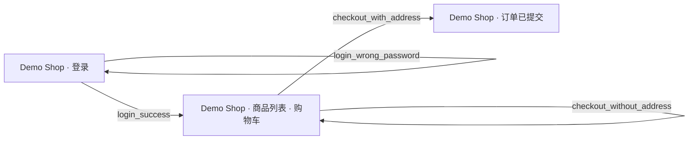

# Exploration of http://127.0.0.1:8765/

| task | kind | result | flow |
|---|---|---|---|
| login_empty_fields | negative | ✅ verified | `flows/explored/login_empty_fields.yaml` |
| login_wrong_password | negative | ✅ verified | `flows/explored/login_wrong_password.yaml` |
| login_success | positive | ✅ verified | `flows/explored/login_success.yaml` |
| add_single_item_to_cart | positive | ❌ failed |  |
| add_multiple_items_to_cart | positive | ❌ failed |  |
| checkout_with_address | positive | ✅ verified | `flows/explored/checkout_with_address.yaml` |
| checkout_without_address | negative | ✅ verified | `flows/explored/checkout_without_address.yaml` |

## Goals

- **login_empty_fields**: 不填写用户名和密码,直接点击“登录”按钮,验证页面仍停留在登录页,并显示必填项或登录失败的错误提示,且未进入登录后的页面。
  - 点击“登录”按钮且未填写用户名和密码后,页面仍停留在登录页(Demo Shop 登录表单仍在),并显示错误提示“用户名或密码错误”,未进入登录后的页面。
- **login_wrong_password**: 在用户名框输入 alice,密码框输入错误密码 wrongpass999,点击“登录”按钮,验证页面仍停留在登录页,并在提示区域显示登录失败/用户名或密码错误的提示信息。
  - Entered alice / wrongpass999 and clicked 登录. The page stayed on the login page and the alert area displayed the error message.
- **login_success**: 在登录表单的用户名框输入 alice,密码框输入 secret123,点击“登录”按钮,验证登录成功:页面离开登录表单,显示商品列表或欢迎/用户信息(如包含 alice)。
  - 输入用户名 alice 和密码 secret123 并点击登录后,页面离开登录表单,显示商品列表及欢迎信息。
- **add_single_item_to_cart**: 在商品列表中点击“机械键盘”对应的“加入购物车”按钮,验证购物车区域不再显示“购物车为空”,而是显示“机械键盘”及价格 ¥399,且“去结算”按钮变为可点击状态。
  - After clicking 加入购物车 for 机械键盘, the cart no longer shows 购物车为空 and 去结算 appears clickable, with no disabled state. But the cart area does not list the item 机械键盘 by name. It only shows the summary '共 1 件，合计 ¥399'. The required cart item display for 机械键盘 could not be verified.
- **add_multiple_items_to_cart**: 依次点击“无线鼠标”和“显示器支架”对应的“加入购物车”按钮,验证购物车中同时显示“无线鼠标 ¥129”和“显示器支架 ¥219”,并且合计金额显示为 ¥348(如页面显示合计)。
  - 两个“加入购物车”按钮都已点击，购物车汇总显示共 2 件、合计 ¥348，与 129+219 相符。但购物车区域没有列出“无线鼠标 ¥129”和“显示器支架 ¥219”的单独条目，所以无法确认购物车同时显示这两项。
- **checkout_with_address**: 点击“机械键盘”的“加入购物车”,在“收货地址”输入框输入“上海市浦东新区世纪大道100号”,点击“去结算”按钮,验证页面显示下单成功/订单已提交的提示信息,并且购物车被清空或显示订单确认内容。
  - Added the mechanical keyboard to the cart, entered the shipping address, and clicked checkout. The page now shows the order-submitted confirmation with the order details and no cart contents.
- **checkout_without_address**: 点击“无线鼠标”的“加入购物车”,保持“收货地址”输入框为空,点击“去结算”按钮,验证页面显示收货地址必填或类似的错误提示,且没有显示下单成功信息,购物车内商品仍保留。
  - Clicked add to cart for 无线鼠标, left the address empty, and clicked 去结算. The page showed the address-required error, no order success message, and the cart still holds the item.
