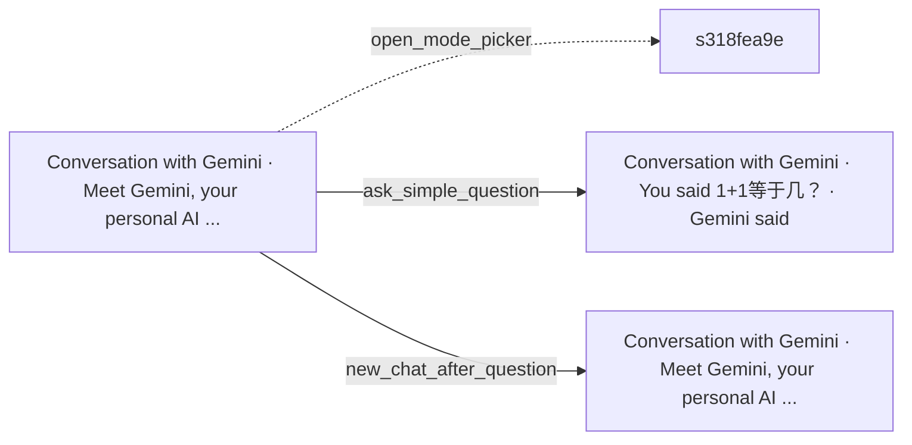

# Exploration of https://gemini.google.com/app

| task | kind | result | flow |
|---|---|---|---|
| open_mode_picker | positive | ⚠️ unverified | `flows/gemini/unverified/open_mode_picker.yaml` |
| ask_simple_question | positive | ✅ verified | `flows/gemini/ask_simple_question.yaml` |
| open_about_gemini | positive | 🔍 needs review |  |
| new_chat_after_question | positive | ✅ verified | `flows/gemini/new_chat_after_question.yaml` |

## Goals

- **open_mode_picker**: Click the button "Open mode picker, currently Flash-Lite" and verify that a menu opens listing selectable model/mode options. Then close the menu with Escape without changing the selection and verify the picker button still shows Flash-Lite.
  - Clicking the mode picker opened a menu listing 3.5 Flash-Lite (selected), 3.6 Flash, 3.1 Pro and a sign-in item. Escape closed the menu, and the picker button still shows Flash-Lite.
- **ask_simple_question**: In the prompt textbox "Enter a prompt for Gemini", type "1+1等于几？" and press Enter to submit. Wait for the response and verify that an answer containing "2" appears in the conversation, with the user's question shown above it.
  - Submitted '1+1等于几？' in the Gemini prompt box and Gemini replied with the answer 2. The user's question appears above the response in the conversation.
- **open_about_gemini**: Click the "About Gemini" button in the side navigation and verify that an About Gemini page or panel with descriptive information about Gemini becomes visible on screen.
  - The side navigation (Images, Sign in, Settings) has no 'About Gemini' button. The 'About Gemini' link is in the main area, and clicking it did not show an About Gemini page or panel. The page is still the Gemini app start screen, so the expected content could not be verified.
- **new_chat_after_question**: Type "1+1等于几？" in the prompt textbox and submit it, wait for the answer to appear, then click the "New chat" link and verify the page returns to the start screen showing the heading "Meet Gemini, your personal AI assistant" with an empty prompt textbox.
  - Submitted '1+1等于几？', received the answer '1+1 等于 2。', then clicked New chat (and confirmed the dialog). The page returned to the start screen with the welcome heading and an empty prompt textbox.
